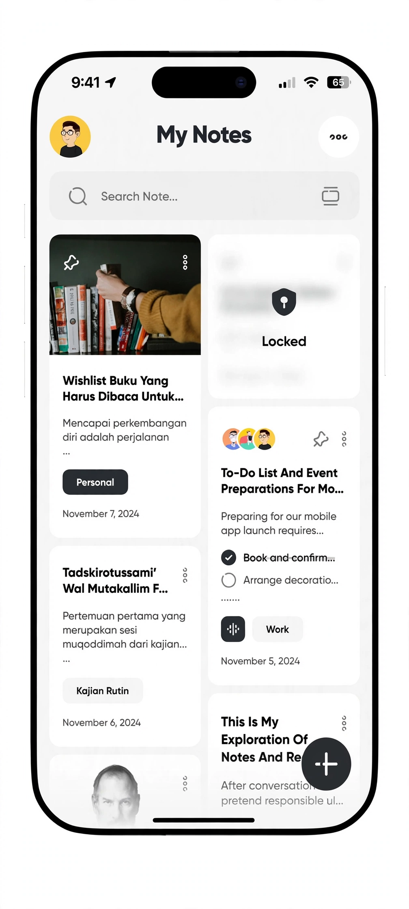
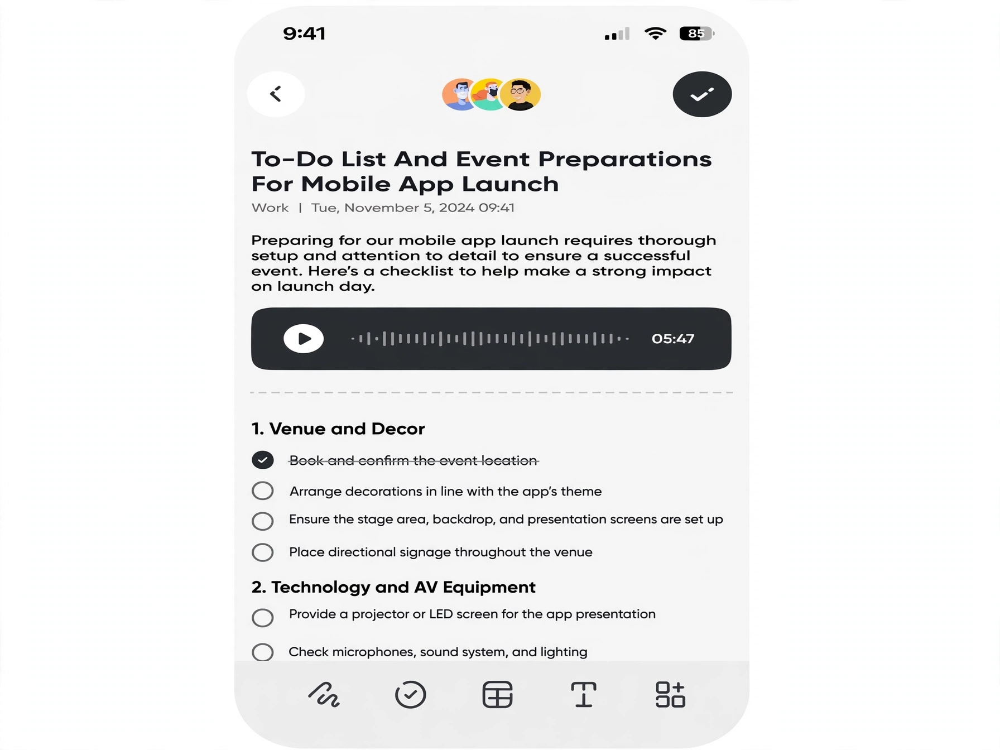
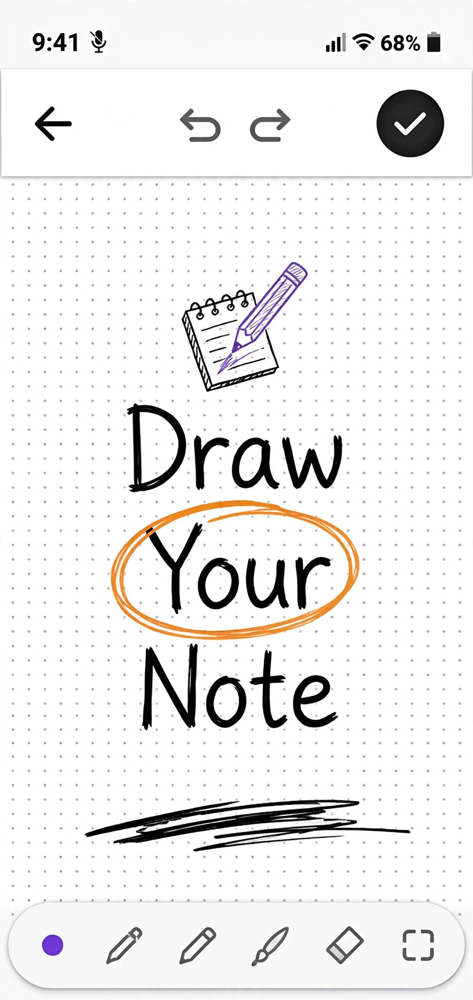
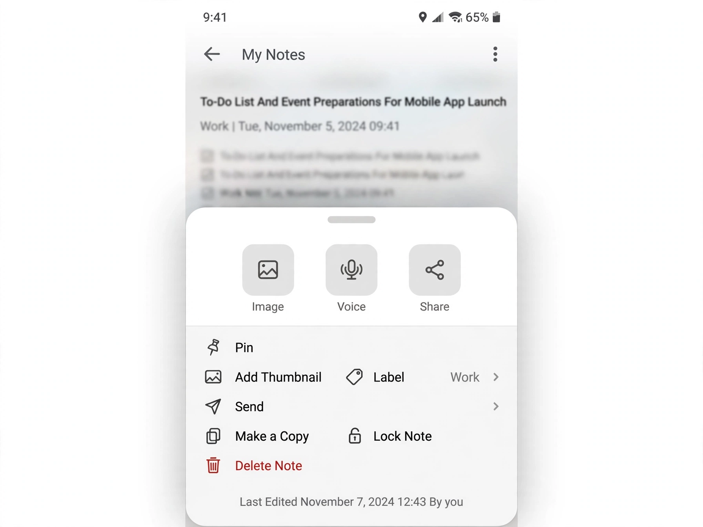

# My Notes

A fast, good-looking notes app for Android. Clean white design, rich text editor,
drawing canvas, checklists, photo notes with on-device OCR, voice notes with an
in-note player, reminders that actually fire, labels, and cloud sync. Free forever —
no paywalls, no account wall. Start anonymous, link Google whenever you want a backup.

## Download

**[MyNotes-v2.0.apk](https://github.com/kurupdevs/MyNotes/releases/download/v2.0/MyNotes-v2.0.apk)**
· [download page](https://kurupdevs.github.io/mynotes/) · [all releases](https://github.com/kurupdevs/MyNotes/releases)

| Home | Note | Drawing | Options |
|---|---|---|---|
|  |  |  |  |

## Features

- Home grid with cover thumbnails, checklist previews, label pills, dates —
  locked notes show a blurred card
- Rich editor: headings (H1–H3), bold/italic/strike/underline, highlighter colors,
  bullets, quotes, per-line checklists, undo/redo, autosave, word count
- Drawing canvas: dotted grid, pen/pencil/eraser, colors, stroke widths, undo/redo —
  sketches live inside the note and stay editable
- Voice notes with an inline player (waveform + duration) right in the note body;
  background recording, speed control
- Note options sheet: Image, Voice, Share · Pin, Add Thumbnail, Label, Send,
  Make a Copy, Reminder, Archive, Note color, Export TXT, Lock Note, Delete
- Photo notes with on-device OCR (text in pictures becomes searchable)
- Reminders with exact alarms (survive reboot), snooze, daily/weekly repeat
- Pin / archive / 30-day trash with restore, colored labels, full-text search
- Share notes with viewer/editor roles, per-paragraph conflict pick-one
- Biometric lock per note (or whole app), dark/light/system theme
- Offline-first: Room is the source of truth, Firestore syncs when online
- Export everything as JSON or a TXT zip

## Build

Prereqs: JDK 17, Android SDK with API 35 + build-tools 35.0.1.

1. `app/google-services.json` is already in the repo (public client config per
   Firebase docs — the API key is locked to the app's package + release cert
   SHA-1 in the Firebase console).
2. Firestore rules are already published live (see `firestore.rules` in the
   parent `mynotes-app/` folder for reference).
3. `./gradlew assembleDebug` for a local debug build.

CI (`.github/workflows/android-build.yml`) builds a **signed release APK** on
every push to `main` and uploads it as an artifact. It needs these repo secrets:
`KEYSTORE_PASSWORD`, `KEY_ALIAS`, `KEY_PASSWORD` (the encrypted keystore
`app/release.keystore.enc` is decrypted in CI with OpenSSL).

## Tech

Kotlin + Jetpack Compose (Material3) · Room (FTS4 search, sync queue) ·
Firebase Auth (anonymous → Google link via Credential Manager) + Firestore ·
Cloudinary (unsigned uploads for images/voice — Firebase Storage needs Blaze) ·
ML Kit on-device text recognition · Media3 · WorkManager · AlarmManager.

`minSdk 26`, `targetSdk 35`, R8 minify on release, `allowBackup=false`.
